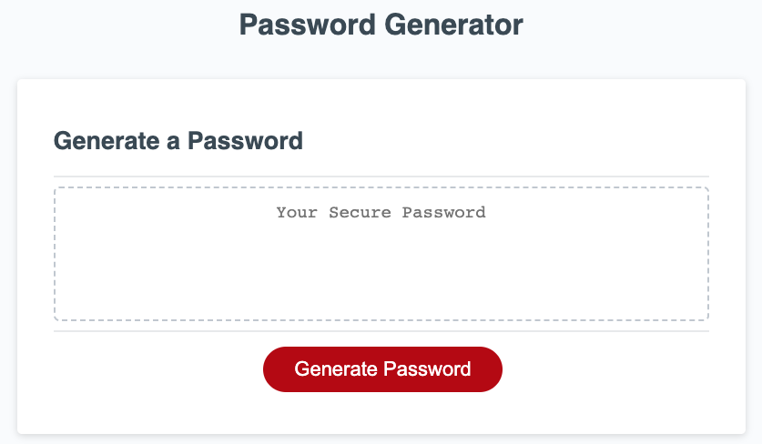

# Password Generator

## Description

This application was created to learn more about JavaScript functions. The motivation behind this project was to create a working password generator given code snippets. I built upon this code in order to further understand how functions interact with local and global variables, how to use 'confirm' and 'prompt' for user interaction, and how to incorporate if loops in a function. 

This project solves the problem of creating a user-generated password. The application will randomly generate a password given certain parameters set by the user.

[Deployed-Website](https://lparr30.github.io/password-generator/)

## Usage

To use the password generator, click the red "Generate Password" button and follow the subsequent prompts.

